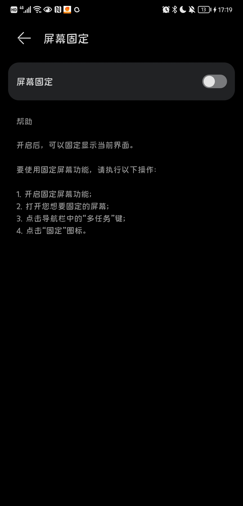
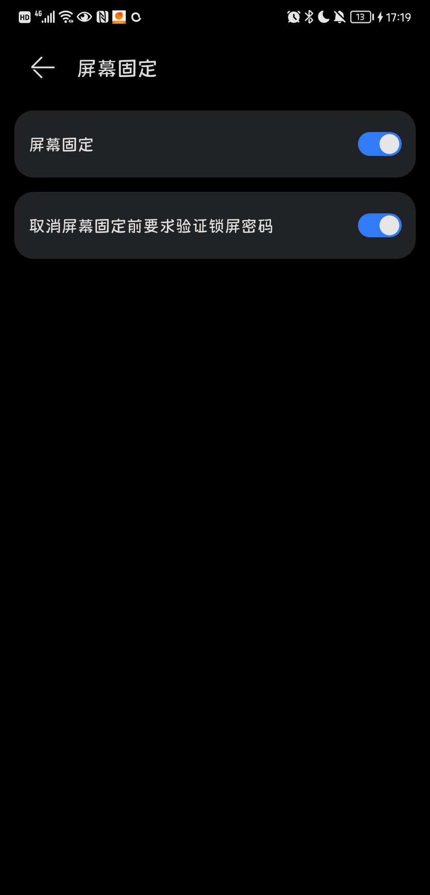
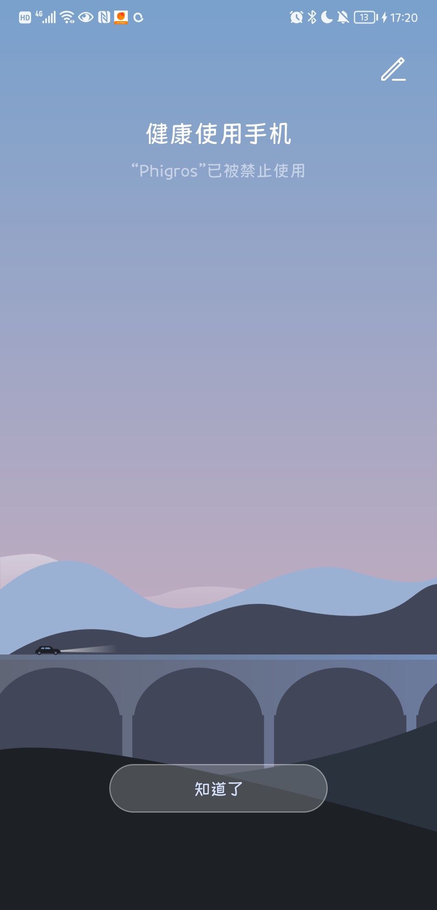
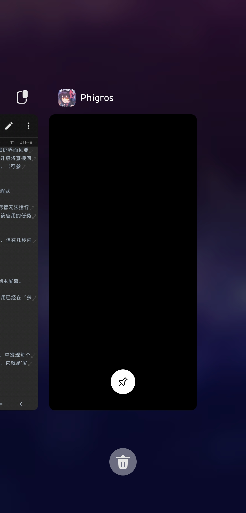
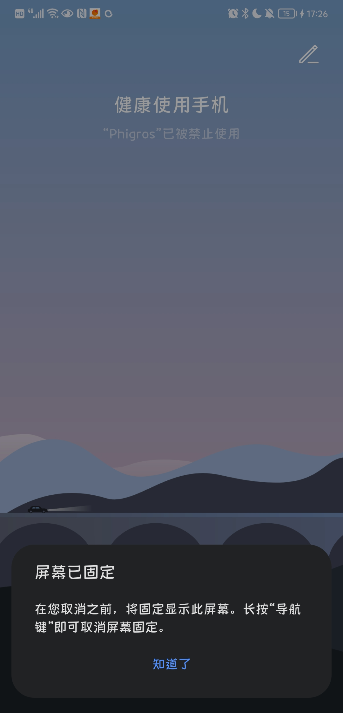
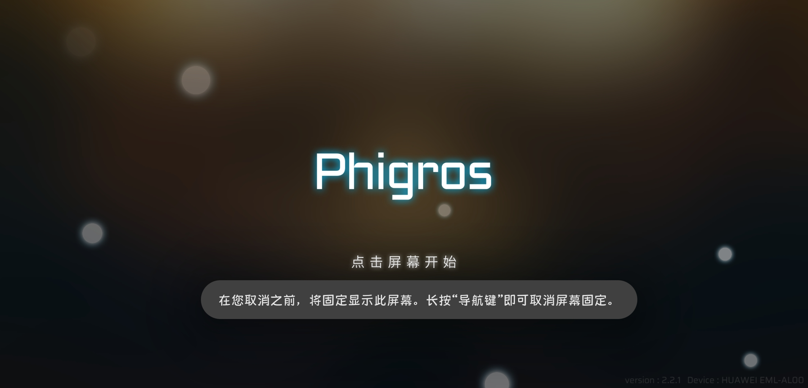

# 华为HarmonyOS绕过健康使用手机限制方法

## 简介

华为HarmonyOS的`健康使用手机`功能，由于优先级小于`屏幕固定`功能，所以可以通过`屏幕固定`来绕过`健康使用手机`功能对于某个应用程式的禁止使用或超时限制。

## 信息预览

- 操作系统:HarmonyOS 2.0.0.216(C00E205R1P5)
- 手机型号:HUAWEI P20(EML-AL00)
- `健康使用手机`程式版本:11.1.1.356
- 示例程式:Phigros（横屏）
- 电脑需求:无需
- 操作难易:2/5

具体操作系统信息见图片:

[Photo_Info1](src/photo_info1.jpg)
## 环境展示

本设备已经将Phigros在`健康使用手机`功能中选择`禁止使用`选项，即始终禁止使用。

[Photo_envi1](src/photo_envi1.jpg)

在主屏幕界面也能看出该应用是灰色禁止状态。

[Photo_envi2](src/photo_envi2.jpg)

进入Phigros，弹出了禁止使用界面，应用无法被打开。

[Photo_envi3](src/photo_envi3.jpg)

接下来，进入正式的步骤。

***

## 步骤

### Step.1.设置`屏幕固定`
打开`设置`-`安全`选项卡-`更多安全设置`菜单-下滑到最后找到`屏幕固定`功能选项卡-打开`屏幕固定`功能。

>Tip:下方的`取消屏幕固定前要求验证锁屏密码`可自选是否开启，开启后退出`屏幕固定`后会返回锁屏界面且要求输入锁屏密码或者生物特征验证，若不开启将直接回到主屏幕界面。开启与否不影响漏洞触发。（可参考Apple的引导式访问退出输入密码）

### Step.2.在「多任务」中创建目标应用程式

>此处利用的是在打开禁止使用的应用时，尽管无法运行太长时间，但在「多任务」中已经新建了该应用的任务。

直接打开目标程式，起初应用可以正常加载，但在几秒内会弹出禁止使用窗口。

直接点击`知道了`或者手动返回桌面，会回到主屏幕。

但是，打开「多任务」界面，可以发现该应用已经在「多任务」中加载且可视。

### Step.3.开启`屏幕固定`

在Step.1的设置后，你应该可以在「多任务」中发现每个应用卡片底部多了一个白色圆形图钉图标，它就是`屏幕固定`功能的触发按钮。

找到目标应用的卡片，点击`屏幕固定`按钮。

应用会被加载。几秒后弹出禁止使用窗口。同时在屏幕底部也会有一个在禁止使用窗口上层的`屏幕已固定`弹窗。

直接点击`屏幕已固定`弹窗中的`确定`按钮，禁止使用窗口会消失，并自动回到目标程式。

此时，限制使用已经被成功绕过。应用可以正常使用。

如果要退出，只需长按Home键；如是全面屏手势，连续上滑屏幕底部两次即可退出。

## 可选修复方案(For Developer)

该漏洞触发关键在于尽管应用被限制，但仍会在「多任务」菜单中被加载且可视，造成`屏幕固定`可以使用且绕过限制。

所以，解决方案可以是对限制使用的应用在限制条件触发造成应用退出时，将该应用在「多任务」菜单的卡片中隐藏。
