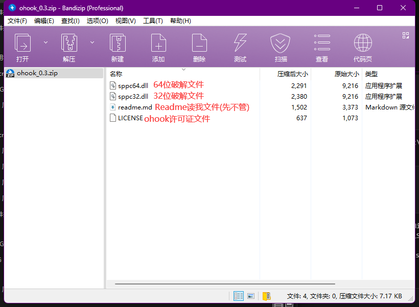

# Office 365 永久激活详解

> Tip: 本文默认您已经会如何安装Microsoft Office 365，下文均以`O365ProPlus`版本(Microsoft 365 Apps for enterprise / Microsoft 365 企业应用版)为例，如何安装请自行搜索。

> Tip: 本文基于开源项目[asdcorp/ohook](https://github.com/asdcorp/ohook)编写。如您喜欢Microsoft Office，请支持正版。

## 准备环境

- 一台Windows 7 以上的电脑 (不支持Windows 7, 本文以Windows11 x64为例, 不同操作系统略有差异.)
- 已安装Microsoft 365 (`O365ProPlus` 或 `O365HomePrem` 均可, 但两者密钥会有所差异)
- 最最最基本的计算机使用知识

## 步骤

### 1. 安装Microsoft 365

你已经会了.

### 2. 以管理员身份打开终端

> 从本步骤往下后的所有操作都需要管理员权限.另外本步骤往后的所有步骤都可以使用一个批处理文件完成.您也可以在[附录](#附录)直接下载批处理文件一键完成安装.

按下键盘的`Win`键, 打开`开始`菜单.


直接在键盘上输入: `cmd`.


点击右边的`以管理员身份运行`.


此时, 应该弹出了终端窗口.


### 3.为文件创建符号链接

在你刚刚打开的终端中, 粘贴指令到终端:

```
mklink "%programfiles%\Microsoft Office\root\vfs\System\sppcs.dll" "%windir%\System32\sppc.dll"
```

并按下Enter键.

如果终端输出:
```
C:\Windows\System32>mklink "%programfiles%\Microsoft Office\root\vfs\System\sppcs.dll" "%windir%\System32\sppc.dll"

为 C:\Program Files\Microsoft Office\root\vfs\System\sppcs.dll <<==>> C:\Windows\System32\sppc.dll 创建的符号链接

```

则说明已经成功.

### 4.复制破解后的sppc.dll

#### 4.1 下载破解后的sppc.dll

打开[ohook Release](https://github.com/asdcorp/ohook/releases)页面,找到最新的Release, 下载压缩包.

> 以下以截稿前最新版本的V0.3为例.

#### 4.2 解压sppc.dll

你应该看到四个文件.



将`sppc64.dll`(如果您安装的是32位Office, 请使用`sppc32.dll`) 解压到一个你找得到的文件夹.

> Office位数怎么看? 如果你使用的是Office Tool Plus, 在你部署Microsoft 365时, 应该可以看到部署设置中的`体系结构`选项, 如果选择的是64位即为64位Office, 32位即为32位Office.


#### 4.3 复制新的sppc.dll

回到上一步使用过的终端窗口.输入指令(别急着执行):

```
copy /y sppc64.dll "%programfiles%\Microsoft Office\root\vfs\System\sppc.dll"
```

注意!在这里,把第一个`sppc64.dll`, 替换成你解压到的sppc破解文件位置, 例如我将sppc64.dll文件解压到了`C:\Users\Administrator.WIN-JP5DLIFTFIU\Downloads\ohook_0.3\sppc64.dll`中, 我就应该将命令改成:

```
copy /y "C:\Users\Administrator.WIN-JP5DLIFTFIU\Downloads\ohook_0.3\sppc64.dll" "%programfiles%\Microsoft Office\root\vfs\System\sppc.dll"
```
注意要加引号避免出现空格无法识别的问题!

> Tip: 复制时要关闭所有Office软件.

若控制台输出类似下方的输出, 大抵是成功了.


### 5. 屏蔽Office许可证检查

我们可以使用修改Hosts文件的方式来屏蔽Office许可证验证.

手动修改Hosts文件的方法固然是可以的, 但是这里为了方便讲述, 直接用CMD指令替换了.

打开上一步用过的终端窗口, 输入指令:

```
echo 0.0.0.0 ols.officeapps.live.com >> %windir%\\System32\\drivers\\etc\\hosts
```

### 6. 安装密钥

下表列出了不同版本需要安装的密钥.

|版本|市场名称|密钥|
|-------|--------------|---|
|O365HomePrem|Microsoft 365|`NBBBB-BBBBB-BBBBB-BBBBG-234RY`|
|O365ProPlus|Microsoft 365 Apps for enterprise / Microsoft 365 企业应用版|`NBBBB-BBBBB-BBBBB-BBBCF-PPK9C`|

复制您安装对应版本的密钥. 再次打开上一步用过的终端窗口, 输入指令(一样先别执行):

```
slmgr -ipk <对应密钥>
```

将`<对应密钥>`替换成上面表格你找到你的版本的密钥. 不要保留`<`和`>`!

例如我安装的是Microsoft 365 企业应用版,


那我就应该执行指令:

```
slmgr -ipk NBBBB-BBBBB-BBBBB-BBBCF-PPK9C
```

对于安装家庭和个人版的用户, 应该使用:

```
slmgr -ipk NBBBB-BBBBB-BBBBB-BBBBG-234RY
```

如果弹出窗口提示类似"成功地安装了产品密钥"即说明成功.


### 7.完成

Enjoy!

## 原理

其实简单的操作背后原理也不复杂.

在上面的操作中, 我们修改到Office中System目录下的sppc.dll来代替系统库.

事实上, 唯一真正的许可证检查是在 Office 应用程序启动期间使用 `SLGetLicensingStatusInformation` 函数完成的,

这就意味着通过修改`SLGetLicensingStatusInformation` 函数可以轻松修改以谎报激活状态.

你可以在https://github.com/asdcorp/ohook/ 查看它的代码.

## 参考资料

[asdcorp/ohook](https://github.com/asdcorp/ohook/)

## 附录

以下是关于文中提到的一键安装的批处理文件

### 使用须知:

1. 必须在可以申请管理员权限的环境下运行.不一定需要右键使用管理员身份运行, 但一定要可以访问系统路径. 至于怎么知道能不能访问呢? 打开试试就知道了.

2. 请将包含批处理文件的压缩包完全解压再运行.

3. bat文件只会自动执行到[第6步](#6-安装密钥) 之前, 这就意味着, 你需要自行执行[第6步](#6-安装密钥) 的安装密钥步骤.

### 下载链接


[蓝奏云下载链接](https://auntnuozhen.lanzoul.com/it92H1af465c)

[本站下载链接](src/ohook-crack.zip)

## 版权提示

本文系Aunt_nuozhen 原创文章，遵循 [CC 4.0 BY-SA](https://creativecommons.org/licenses/by-sa/4.0/) 版权协议，转载请附上原文出处链接和本声明。